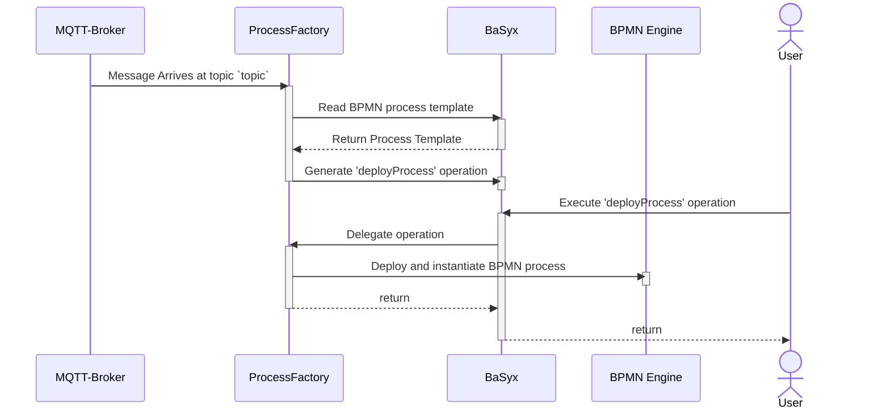

# Arena - ProcessFactory

1. Listens to any message in the topic `topic`; when it arrives, do:
  1. Reads the BPMN process template from SM/SE 'ubmodel/ProcessFileSE' (attachment of a fileSE)
  2. Generates the operation 'deployProcess' in 'OperationsSubmodel'
  3. When the operation is executed in BaSyx, the BPMN process is deployed and instantiated to the BPMN Engine
  

## Executing example scenario

1. Run `mvn clean package -DskipTests` to generate the docker and image and push to the local Docker repository
2. Execute [scenario-demo-1/docker-compose](example/scenario-demo-1/docker-compose.yml) via `docker compose up`

The service is available at:
  - http://localhost:8110
  - A list of the available APIs is available at http://localhost:8110/swagger-ui/index.html

3. Sending a message to the topic `test_topic` (broker available at port 1884) automatically triggers the deployment of the operations in the configured OperationSM.
4. Executing the Operation in the OperationSM deploys and instantiate the process in the Zeebe server

 Note: Tested under Ubuntu 22.04 + Adoptium JDK21
Note2: `localhost` is assumed as host.

## Testing

1. Make sure the `ci/docker-compose.yml` is up and running
2. Execute `mvn test` or `mvn verify` for the IT tests.

## Configuring

An example configuration file is found at the [example/scenario-demo-1](example/scenario-demo-1/config/processfactory.properties). All relevant properties can be easily changed there, e.g. MQTT, Zeebe, BaSyx. 

## Appendix

### Camunda 

Relevant UI endpoints:

- [Operate](http://localhost:8081)
- [Tasklist](http://localhost:8082)

Username/Password: demo/demo