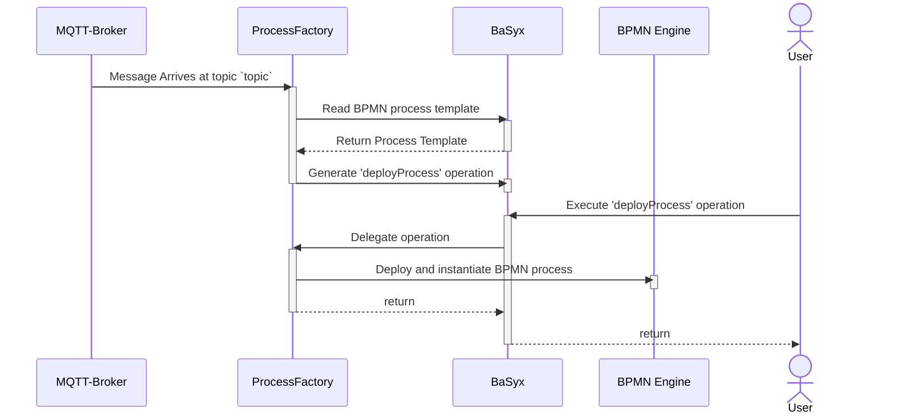

# Arena - ProcessFactory

1. Listens to any message in the topic `topic`; when it arrives, do:
  1. Reads the BPMN process template from SM/SE 'ubmodel/ProcessFileSE' (attachment of a fileSE)
  2. Generates the operation 'deployProcess' in 'OperationsSubmodel'
  3. When the operation is executed in BaSyx, the BPMN process is deployed and instantiated to the BPMN Engine
  

## Configuring

An example configuration file is found at the [example/scenario-demo-1](../example/scenario-demo-1/config/processfactory.properties). All relevant properties can be easily changed there, e.g. MQTT, Zeebe, BaSyx. 

| property | defaultValue | description |
| -- | -- | -- |
| server.port | 8110 | Port to start the service | 
| server.externalUrl | http://localhost:8110 | URL for external services accessing this service | 
| mqtt.hostname | - | MQTT Broker hostname |
| mqtt.port | - | MQTT Broker port |
| mqtt.username | - | MQTT Broker username |
| mqtt.password | - | MQTT Broker password |
| mqtt.topic | - | MQTT topic to listen to |
| basyx.processSmUrl | - | Base URL pointing to the ProcessSubmodel  |
| basyx.processFileSEIdShort | - | IdShort from the SE, from which the BPMN file is read |
| basyx.operationsSmUrl | - | Base URL pointing to the OperationsSubmodel. This is where this service's operations are going to be deployed |
| camunda.zeebeGateway | - | Zeebe gRPC endpoint |
| camunda.managedProcessPath | /tmp | Server path where BPMN files are stored |