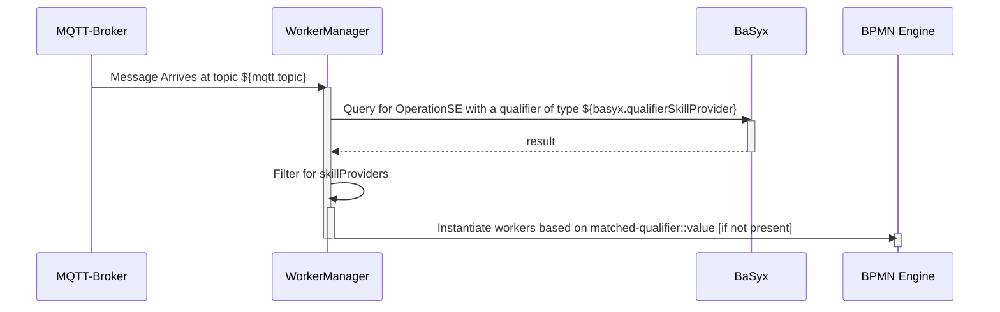

# Arena - WorkerManager 

- Listens to any MQTT message on the topic `${mqtt.topic}` from BaSyx, when it arrives, do:
  - Instantiates a new Camunda Worker for the specific device capability.
    - For each OperationSE with a qualifer (`matched-qualifier`) of type `${basyx.qualifierSkillProvider}` do:
      - Instantiate a REST camunda worker of id `matched-qualifier::value`

# Requirements

- It shall react to changes in the AAS. E.g.:
  - If the target AAS is deleted, the camunda worker shall be stopped
  - If the job type changes, the worker shall be restarted with a new job

## Configuring

An example configuration file is found at the [example/scenario-demo-1](../example/scenario-demo-1/config/processfactory.properties). All relevant properties can be easily changed there, e.g. MQTT, Zeebe, BaSyx. 

| property | defaultValue | description |
| -- | -- | -- |
| server.port | 8111 | Port to start the service | 
| mqtt.hostname | - | MQTT Broker hostname |
| mqtt.port | - | MQTT Broker port |
| mqtt.username | - | MQTT Broker username |
| mqtt.password | - | MQTT Broker password |
| mqtt.topic | - | MQTT topic to listen to |
| basyx.aasRegistryUrl | - | AasRegistry base endpoint |
| basyx.aasRepositoryUrl | - | AasRepository base endpoint |
| basyx.submodelRegistryUrl | - | SubmodelRegistry base endpoint |
| basyx.submodelRepositoryUrl | - | SubmodelRepository base endpoint |
| basyx.qualifierSkillProvider | skill-provider | OperationSE qualifier for skill providers |
| camunda.zeebeGateway | - | Zeebe gRPC endpoint |